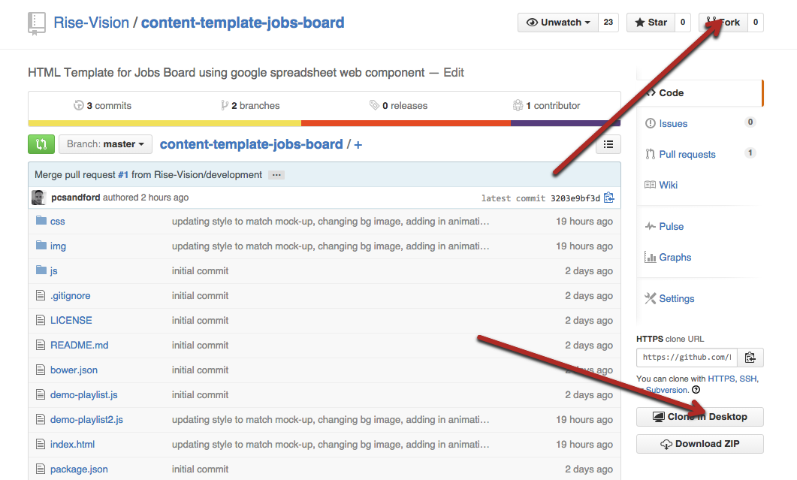
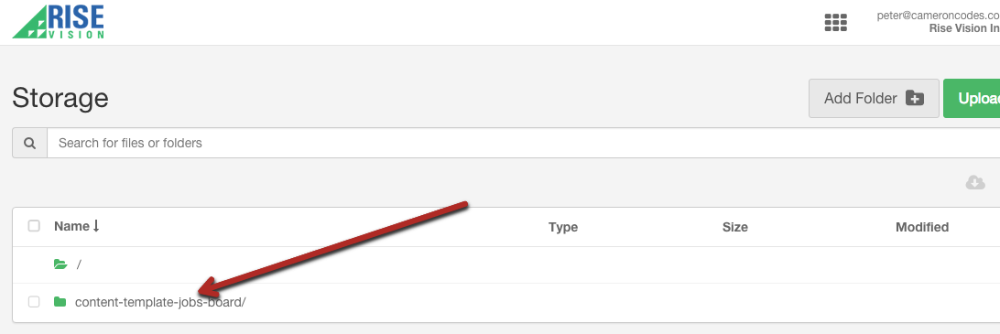

## Introduction

The interactive Jobs Board template was created to display a series of job vacancies using the Rise Vision Google Sheet component. A preview of the template can be viewed here: https://storage.googleapis.com/risemedialibrary-f114ad26-949d-44b4-87e9-8528afc76ce4/peter/content-template-jobs-board/index.html

## Steps to run the Jobs Board Template

1. Fork or download the entire content-template-jobs-board repository.  


2. Modify the files within the content-template-jobs-board folder directory to fit your needs (see below on how to modify specific elements).  


3. Host the entire “content-template-jobs-board” folder directory in rise vision storage or your web hosting service.  


4. Copy the link to the index.html file where you have it hosted and insert the url into a schedule. (you can also add this link to the url gadget within a presentation)  


##Directions to Modify the Jobs Board Template:##


####Changing the Header Text
Open index.html, locate the following code and modify the text between the <h1> tags:

```
<div id="boardTitle">
  <h1>Current Job Opportunities</h1>
</div>
```


####Changing the Background Image
Open main-style.css, locate the following code and modify the url of the background-image to the path of your new background:

```  
.wrapper:after {
  ...
  background-image: url("../img/jobsImage2.jpg");
  ...
```

If you want to remove the semi-opaque overlay, locate the following code within main-style.css and modify the rgba value as required:

```
.wrapper {
  ...
  background: rgba(52,73,94,0.7);
  ...
```


####Changing the Icon Image

Open index.html, locate the following code and modify the path of the src attribute of the img tag to the path of your new icon:

```  
  
```


####Changing The Text Content
The text content is displayed through the use of the rise-google-sheet web component. The example spreadsheet is located at https://docs.google.com/spreadsheets/d/1dhi3P84DlwjLY5Q3W-xOzLcAzl3q58ppmyrHMw2TGBg/edit#gid=0

The jobs text is found on sheet 1 and the the secondary text is on sheet 2.

You can use your own public spreadsheet by locating the following code in the index.html file:

```
<google-sheets id="googleSheet"
               key="1dhi3P84DlwjLY5Q3W-xOzLcAzl3q58ppmyrHMw2TGBg"
               tab-id="1"
               min-row="1" 
               min-column="1" 
               max-column="12"
               refresh="300">
</google-sheets>

```
The columns and rows can be targeted using the min and max values. 

The key for your spreadsheet can be found when viewing the document online, as can be seen in the example above. 

In order to view a private spreadsheet, you will need to obtain an ID from https://console.developers.google.com. This is optional if accessing a public spreadsheet, and is currently set to 'sheet' in the above example.

You can then edit the text within the cells of the spreadsheet and the changes will appear in the display.

#### Using a second instance of the rise-google-sheet component

The second instance of the rise-google-sheet component is set up in the same way as above, using the same key attribute. In the example, the id attribute is changed to 'googleSheet2' and the tab-id attribute is changed to '2' because the text is taken from the second sheet of the google spreadsheet.

## Built With
actual tools used
- HTML
- CSS
- Rise-Google-Sheet Web Component
- Javascript
- JQuery


Hospital Template works in conjunction with [Rise Vision](http://www.risevision.com), the [digital signage management application](http://rva.risevision.com/) that runs on [Google Cloud](https://cloud.google.com).

At this time Chrome is the only browser that this project and Rise Vision supports.

## Submitting Issues
If you encounter problems or find defects we really want to hear about them. If you could take the time to add them as issues to this Repository it would be most appreciated. Please identify the specific template that has the issue and follow the following format where applicable:

**Reproduction Steps**

1. did this
2. then that
3. followed by this (screenshots / video captures always help)

**Expected Results**

What you expected to happen.

**Actual Results**

What actually happened. (screenshots / video captures always help)

## Contributing
All contributions are greatly appreciated and welcome! If you would first like to sound out your contribution ideas please post your thoughts to our [community](http://community.risevision.com), otherwise submit a pull request and we will do our best to incorporate it.

### Suggested Contributions
- Alternative ways to animate text scroll
- Alternative ways to style text
- i18n Language Support

## Resources
If you have any questions or problems please don't hesitate to join our lively and responsive community at http://community.risevision.com.

If you are looking for user documentation on Rise Vision please see http://www.risevision.com/help/users/

If you would like more information on developing applications for Rise Vision please visit http://www.risevision.com/help/developers/.

 If you have any questions or problems please don't hesitate to join our lively and responsive community at http://community.risevision.com.
 
**Additional Content Templates can be found here: https://github.com/Rise-Vision/content-templates**

**Facilitator**

[Peter Sandford](https://github.com/pcsandford "Peter Sandford")

